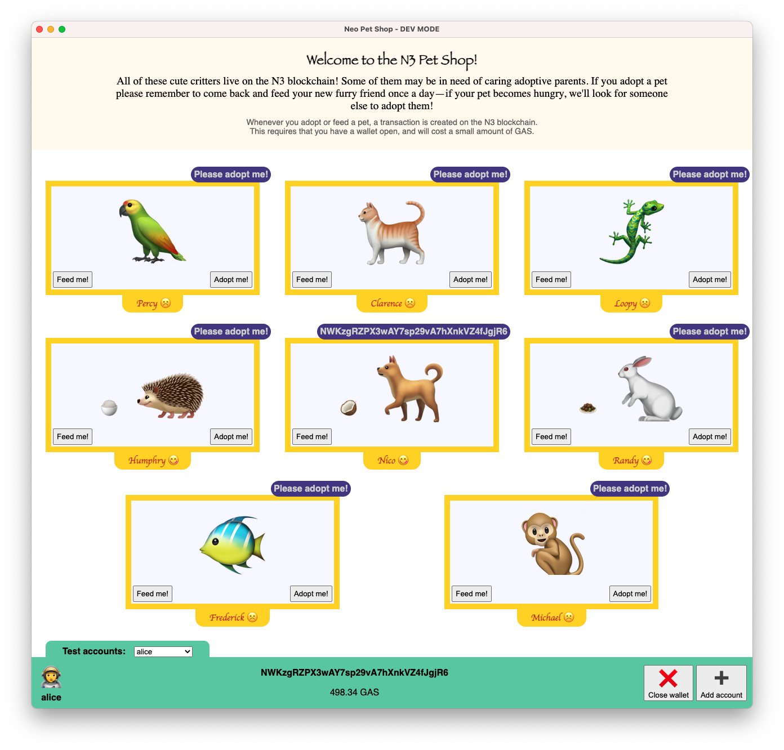

# N3 Pet Shop

When .NET was launched back in the day, we built the .NET Pet Shop to herald the arrival of a new platform, and today we are building the N3 Pet Shop to welcome N3.

This version uses Electron to get around the browser extension issues (wallet).

## Screenshot



## Building and running using N3 TestNet

Clone this repo, change into the repo directory and then run the `start` script using `npm`:

```
git clone git@github.com:ngdenterprise/neo-pet-shop-electron.git
cd neo-pet-shop-electron
npm install
npm run start
```

The Electron app will load and operate using an instance of the Pet Shop Contract that has been deployed to N3 TestNet.

You will need a wallet to use the app (you can create a new one from within the app if needed) and you will need some TestNet GAS (get 500 TestNet GAS for free from the [N3 TestNet Faucet](https://neowish.ngd.network/#/)).

## Building and running using a Neo Express PrivateNet

Build the C# smart contract code using `dotnet`:

```
git clone git@github.com:ngdenterprise/neo-pet-shop-electron.git
cd neo-pet-shop-electron
cd NeoPetShop
dotnet build
```

Use the [Neo Blockchain Toolkit](https://marketplace.visualstudio.com/items?itemName=ngd-seattle.neo-blockchain-toolkit) extension for VS Code to create a Neo Express blockchain and deploy the contract to it.

> **Tip:** If you are not familiar with using Neo Express and the Neo Blockchain Toolkit, checkout the [N3 "Quick Start" video series and tutorials](https://ngdenterprise.com/neo-tutorials/).

Take note of your contract hash (this can be seen by looking at your deployment transaction within the Visual DevTracker and will look something like `0xfb1bdf761a98c0127a55740076d755d222d14f7f`).

Edit the `src-server/index.ts` file to use your PrivateNet instead of TestNet. Replace the contract hash in the `PRIVATENET` constant to match your deployed contract:

```
const PRIVATENET: BlockchainParameters = {
  rpcUrl: "http://127.0.0.1:50012",
  contractHash: "0xfb1bdf761a98c0127a55740076d755d222d14f7f",
  magic: 3345620479,
};
```

Also modify the `blockchainParameters` constant to use `PRIVATENET` instead of `TESTNET`:

```
const blockchainParameters = PRIVATENET;
```

Run the Electron app:

```
npm run start
```

The Electron app will load and operate using the Pet Shop Contract deployed to your Neo Express PrivateNet.

## Navigating the source code

The source code is divided into top-level folders as follows:

- `public`
  - Minimal JavaScript to launch and interface with the Electron app and minimal HTML/CSS to render the initial (empty) browser window.
- `src`
  - TypeScript code (using the React framework) to render the Pet Shop user interface. Changes made to this code will automatically take effect in any running instance of the app without requiring a restart (hot refresh).
- `src-server`
  - TypeScript code that contains the pet shop backend business logic and communicates with the N3 blockchain. An app restart is required after changing code in this folder.
- `src-shared`
  - Type definitions for data shared between the backend and UI layer.
